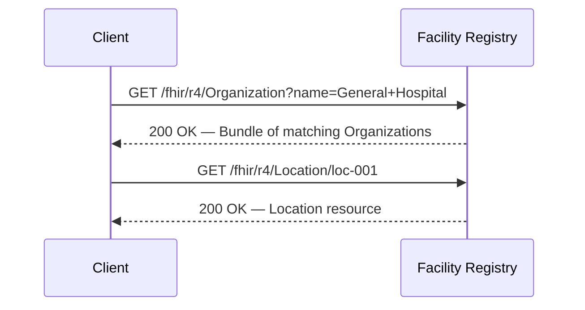
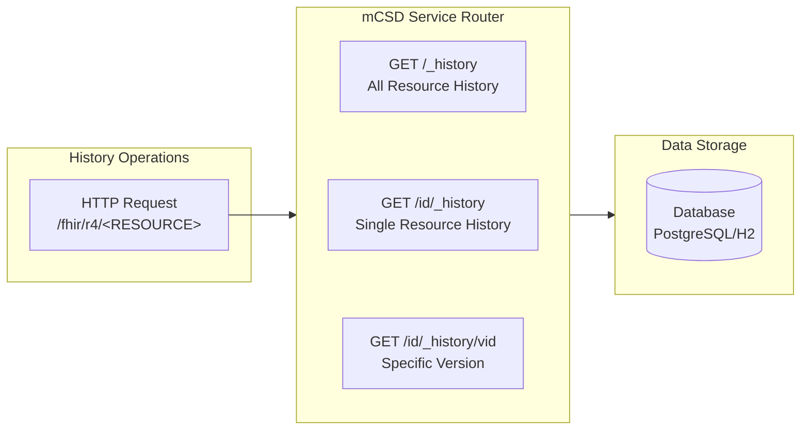
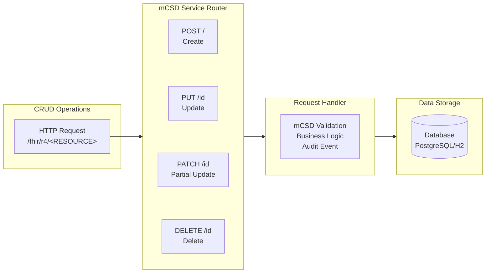
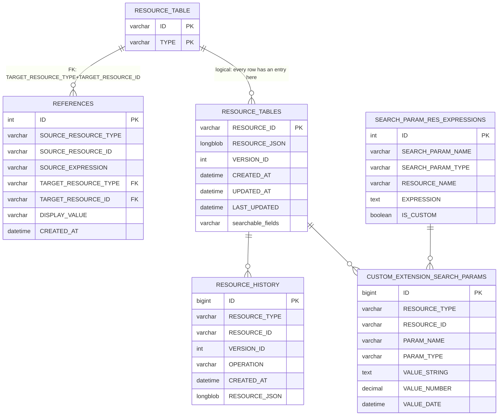

# Facility Registry

An OpenHIE Facility Registry implementation built with Ballerina, conforming to the IHE mCSD (Mobile Care Services Discovery) profile. Supports H2 (embedded) or PostgreSQL as the backing database.

## Overview

The Facility Registry manages healthcare facility and service data using FHIR R4 resources. It implements three IHE mCSD transactions:

| Transaction | Description |
|-------------|-------------|
| **ITI-90** | Find Matching Care Services — search and read |
| **ITI-91** | Request Care Services Updates — resource history |
| **ITI-130** | Maintain Care Services — create, update, delete |

### Supported FHIR Resources

- **Organization** — healthcare facilities and organizations
- **OrganizationAffiliation** — relationships between organizations
- **HealthcareService** — services offered at a facility
- **Location** — physical locations and addresses
- **Endpoint** — technical connection endpoints for a service

## Features

### 1. Metadata

```
GET /fhir/r4/metadata
```

Returns the server CapabilityStatement listing supported resources, transactions, and search parameters.

### 2. ITI-90 — Find Matching Care Services



Supports search and read (including versioned read) for all mCSD resources.

**Search Parameters (common):**
- `_id` — search by resource ID
- `_lastUpdated` — filter by modification date
- `_count` — page size
- `_include` — include referenced resources (e.g., `_include=Location:organization`)
- `_revinclude` — include resources referencing results (e.g., `_revinclude=HealthcareService:location`)

**Example Search Queries:**
```
GET /fhir/r4/Organization?name=Hospital&_count=20
GET /fhir/r4/Location?address-country=LK&_include=Location:organization
GET /fhir/r4/HealthcareService?organization=Organization/org-001
GET /fhir/r4/OrganizationAffiliation?primary-organization=Organization/org-001
```

### 3. ITI-91 — Request Care Services Updates



Returns a history Bundle of all changes (CREATE / UPDATE / DELETE) for a resource or resource type.

### 4. ITI-130 — Maintain Care Services



### 5. Validation — `$validate`

Available for all supported resource types.

```
POST /fhir/r4/Organization/$validate
POST /fhir/r4/Location/$validate
POST /fhir/r4/HealthcareService/$validate
POST /fhir/r4/OrganizationAffiliation/$validate
POST /fhir/r4/Endpoint/$validate
```

Validates a resource against the FHIR R4 specification and any registered custom profiles. Returns an `OperationOutcome`.

### 6. History Tracking

Every CREATE, UPDATE, and DELETE is captured as a snapshot in `RESOURCE_HISTORY`, enabling full audit trails via the `_history` endpoints.

### 7. Audit Service Integration

When `auditServiceUrl` is configured, the server automatically posts a FHIR `AuditEvent` to the audit service on every CRUD operation (ITI-20 compliant).

## Quick Start

### Prerequisites

- [Ballerina](https://ballerina.io/downloads/) 2201.12.11 or later
- Java 21 or later
- H2 (bundled) or PostgreSQL 17 or later

### Starting the Server

**Unix/macOS/Linux:**
```bash
chmod +x start-server.sh
./start-server.sh
```

**Manual:**
```bash
bal run
```

The server starts on `http://localhost:9090` using H2 at `./data/fhir-db`.

## Configuration

Edit `Config.toml` to customise the server:

```toml
# ── Database ──────────────────────────────────────────────────────────────────
[facility_registry.handlers]
# "h2" (default) or "postgresql"
dbType = "h2"
dbUrl  = "jdbc:h2:./data/fhir-db"
dbUser = "sa"
dbPassword = ""
# For PostgreSQL:
# dbType    = "postgresql"
# dbUrl     = "jdbc:postgresql://localhost:5432/facility_registry"
# dbUser    = "<dbUser>"
# dbPassword = "<dbPassword>"
clearDataOnStartup = false   # WARNING: wipes all data on startup when true

# ── Resource ID Generation ────────────────────────────────────────────────────
[facility_registry.utils]
dbType = "h2"                 # must match handlers.dbType
useServerGeneratedIds = true  # server auto-assigns UUIDs; client IDs are ignored

# ── Server Identity ───────────────────────────────────────────────────────────
[facility_registry]
serverName     = "OpenHIE Facility Registry"
auditServiceUrl = ""          # leave empty to disable audit events
iti90Enabled   = true         # Find Matching Care Services
iti91Enabled   = true         # Request Care Services Updates
iti130Enabled  = true         # Maintain Care Services

# ── Base URL ─────────────────────────────────────────────────────────────────
[facility_registry.mappers]
baseUrl = "http://localhost:9090"
```

### Key Configuration Options

**Database Type** — `handlers.dbType` and `utils.dbType` must have the **same** value.

**ID Generation:**
- `useServerGeneratedIds = true` — server generates UUIDs (recommended for Facility Registry)
- `useServerGeneratedIds = false` — client must supply an `id` field

**IHE Transactions** — each transaction can be individually enabled/disabled at runtime. Disabled transactions return `405 Method Not Allowed`.

**Audit Service** — set `auditServiceUrl` to the URL of an audit service accepting `POST /audits` with a FHIR `AuditEvent` body.

## Database Management

### Schema Overview



Each mCSD resource type (Organization, Location, etc.) has its own `[ResourceType]Table`. `RESOURCE_TABLE` is a super-table used to enforce referential integrity across all resource types via a composite foreign key, eliminating per-request reference-existence queries.

### Database Initialisation

**H2** — created automatically on first run; no manual step required.

**PostgreSQL** — create a database and run `scripts/schema-postgresql.sql` to create the tables:
```sql
CREATE DATABASE facility_registry;
```
Then execute the schema script.

### Clear Data on Startup

```toml
[facility_registry.handlers]
clearDataOnStartup = true  # WARNING: deletes all existing data
```

## Switching Database

1. Update `dbType` in both `[facility_registry.handlers]` and `[facility_registry.utils]`
2. Set the corresponding `dbUrl`, `dbUser`, and `dbPassword`
3. For PostgreSQL, initialise the schema first
4. Restart the server
